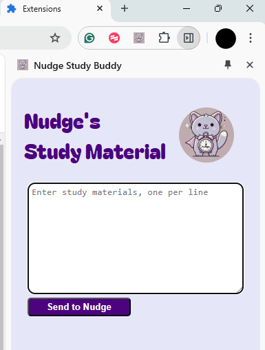
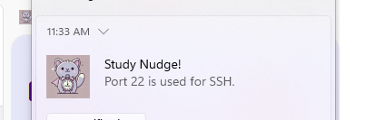

# Nudge Study Buddy Chrome Extension


This is a Chrome extension designed to help users save, retrieve, and display study materials as reminders. The extension uses the Chrome Storage API to save study notes and periodically displays notifications to nudge the user to review them.

---

*Built to accompany a lightning talk introducing Chrome extensions, not for optimal UX/UI or commercial use.*

## Features

- **Save Study Materials**:
  - Add study notes directly through the extension's sidebar interface.
  - Notes are stored using Chrome's `chrome.storage.local` API.

- **Retrieve and Edit Notes**:
  - Previously saved notes are loaded into the sidebar's textarea on initialization.
  - Users can edit or update their study materials as needed.

- **Periodic Reminders**:
  - Notifications are displayed periodically, pulling study notes to help the user stay on track.

- **Event-Triggered Notifications**:
  - Notifications are also triggered when a new browser tab is opened.

---

## Installation

1. **Clone or Download the Repository**:
   ```bash
   git clone https://github.com/Tremckinley/study-materials-extension.git
   ```

2. **Load the Extension into Chrome**:
   - Go to `chrome://extensions` in your browser.
   - Enable **Developer mode** (toggle in the top-right corner).
   - Click **Load unpacked** and select the folder containing the extension files.

3. **Start Using the Extension**:
   - The extension icon will appear in the Chrome toolbar.
   - Click the icon to open the sidebar and start adding notes.

---

## How It Works

 
### **Sidebar Interface**
- A simple textarea is used to display and edit study materials.
- Clicking the **Save** button processes the notes and stores them in Chrome's local storage.
### **Storage and Retrieval**
- Data is stored in Chrome's `local.storage` in JSON format.
- Notes are automatically loaded and displayed when the sidebar is opened.

### **Notifications**
- A Chrome alarm triggers every 12 seconds (for testing purposes; adjust for production) to display a notification with a study note.
- Notifications cycle through the saved notes.

### **Tab Events**
- Notifications are triggered when a new browser tab is created.
- The alarm resets on each tab creation to ensure consistent intervals.

---

## Code Breakdown

### **Key Scripts**

1. **`background.js`**
   - Listens for extension icon clicks and initializes sidebar functionality.
   - Sets up periodic alarms and listens for tab creation events.

2. **`content.js`**
   - Handles UI interactions within the sidebar.
   - Retrieves and saves study materials from Chrome storage.

3. **`manifest.json`**
   - Defines the extension's metadata and permissions, including `chrome.storage` and `chrome.notifications`.

---

## Usage

1. **Add Notes**:
   - Open the extension sidebar by clicking the icon.
   - Enter your study notes, one per line, in the textarea. *Security+ Notes included for convenience*
   - Click the **Save** button to store your notes.

2. **Receive Notifications**:
   - Notifications will appear periodically, reminding you of random study notes.

3. **Edit Notes**:
   - Open the sidebar and edit your notes as needed.
   - Save the changes to update the stored data.

---

## Permissions

The following permissions are required:

- **`storage`**: To save and retrieve study materials.
- **`notifications`**: To display periodic reminders.
- **`alarms`**: To set up periodic tasks.

---

## Development Notes

### **Testing Notifications**
- Modify the alarm interval in `background.js` for faster testing:
  ```javascript
  chrome.alarms.create("studyNudge", { periodInMinutes: 0.2 }); // 12 seconds for testing
  ```
- **There is currently no method to pause notifications in the user interface.**
    - Disable the extenstion or clear the textarea to stop notifications.

### **Error Handling**
- Ensure proper parsing of JSON data in `content.js` to avoid crashes.
- Reset `textarea` if parsing fails.

---

## Future Improvements

- Add options for users to customize notification intervals.
- Add option ability to pause notifications.
- Add fucntionality to "Mastered!" button to remove a single line from memory.
- Enhance the UI with more styling and interactive elements.
- Implement categories or tags for organizing study notes.
- Sync notes across devices using `chrome.storage.sync`.
- Implement a backend server.
- Render notes on sidebar instead of via notification

---

## License

This project is licensed under the MIT License. See the `LICENSE` file for details.

---

## Contributions

Contributions are welcome! Feel free to open issues or submit pull requests to enhance functionality or fix bugs.

